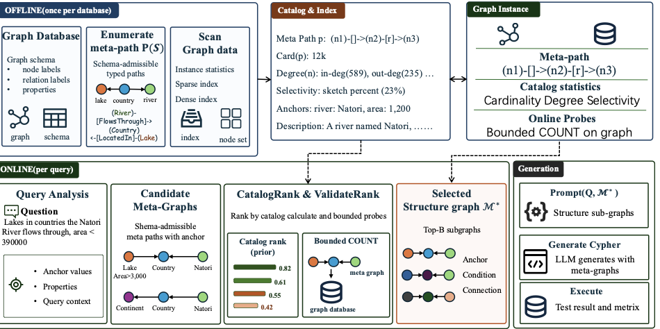

# MetaCypher

[](LICENSE)
[](https://github.com/dm-ecnu/metacypher/actions/workflows/ci.yml)

MetaCypher is a catalog-grounded Text-to-Cypher system for property-graph
databases. Given a natural-language question, it performs schema-aware query
analysis and entity linking, retrieves a compact set of relevant subgraph paths
from an enriched schema catalog, ranks the resulting evidence with a
ValidateRank-style scoring pass, synthesises a Cypher query with an
OpenAI-compatible LLM, and then repairs the output using execution feedback and
related-schema evidence.

---

## Framework



`docs/framework.pdf` is the vector copy used in the paper. The pipeline stages
correspond directly to the executable modules described in
[Running the pipeline](#running-the-pipeline).

---

## Quick start

### Offline smoke (no Neo4j, no LLM, no data)

Verifies that config resolves and the core query-analysis logic works on a
fresh checkout in under five seconds:

```bash
cd metacypher && python3 ../examples/smoke_offline.py
```

Expected final line: `MetaCypher offline smoke: PASSED`

Or via Make:

```bash
make smoke
```

### Deployment tiers

| Tier | What runs | Needs |
|---|---|---|
| **T0 — offline smoke** | config resolution + core query-analysis logic | nothing (fresh clone) |
| **T1 — full pipeline** | analyze → retrieve → generate → correct, real EX | `requirements.txt`, CypherBench Neo4j graphs, an OpenAI-compatible LLM endpoint (a local vLLM **or** the hosted ECNU endpoint — see `.env.example`) |

`METHOD_MAP.md` maps each paper concept (section / algorithm / equation) to its
code location, including an honest note that the catalog/ValidateRank wiring is
opt-in. `EXPERIMENTS.md` is the runbook for producing measured numbers.

### Full pipeline quick start

```bash
cp .env.example .env          # fill in data dir, LLM endpoint, Neo4j creds
set -a && source .env && set +a
make neo4j-up                 # start all CypherBench Neo4j containers
make analyze                  # step 1 — query analysis
make retrieve                 # step 2 — subgraph/path retrieval
make generate                 # step 3 — Cypher generation
make correct                  # step 4 — execution-guided correction
```

---

## Install

```bash
pip install -r requirements.txt
# or
make install
```

`requirements.txt` is pinned to stable reference versions (2026-06-09).
The heavy embedding stack (`sentence-transformers`, `torch`, `faiss-cpu`) is
only required for the optional FAISS attribute-search step; the rest of the
pipeline runs without it.

### Run with Docker

A `docker-compose.yml` brings up all 11 CypherBench Neo4j graph containers plus
the MetaCypher app container on a shared bridge network (`metacypher-net`).
Each Neo4j instance is health-checked before the app starts.

```bash
make neo4j-up          # docker compose -f docker-compose.yml up -d
# ... wait for Neo4j to be healthy ...
make analyze           # or docker compose run metacypher make analyze
make neo4j-down        # docker compose down
```

Available Makefile targets:

| Target | Description |
|---|---|
| `install` | `pip install -r requirements.txt` |
| `smoke` | Offline smoke test (no external services) |
| `neo4j-up` | Start all Neo4j containers (`docker compose up -d`) |
| `neo4j-down` | Stop containers (`docker compose down`) |
| `analyze` | Run `query_analyze.py` (pass extra flags via `ARGS=`) |
| `retrieve` | Run `all_subgraph_set.py` |
| `generate` | Run `generation.py` |
| `correct` | Run `correction.py` |

---

## Setup

All machine-specific paths and service endpoints are read from environment
variables by `metacypher/config.py`. No source edits are needed:

```bash
cp .env.example .env
# edit .env — at minimum set METACYPHER_DATA_DIR
set -a && source .env && set +a
```

Key variables (full list in `.env.example`):

| Variable | Default | Description |
|---|---|---|
| `METACYPHER_DATA_DIR` | `./data/` | Root for datasets, schemas, FAISS indexes |
| `METACYPHER_VLLM_BASE_URL` | `http://localhost:8000/v1` | OpenAI-compatible LLM endpoint |
| `METACYPHER_VLLM_MODEL` | `local_llm` | Model name forwarded to the endpoint |
| `METACYPHER_VLLM_API_KEY` | `EMPTY` | API key (use `EMPTY` for local vLLM) |
| `NEO4J_HOST` | `localhost` | Neo4j hostname |
| `NEO4J_USER` | `neo4j` | Neo4j username |
| `NEO4J_PASSWORD` | `cypherbench` | Neo4j password |
| `METACYPHER_EMBED_MODEL` | `BAAI/bge-m3` | Embedding model (HF id or local path) |

No credentials are committed to this repository.

---

## Data

The pipeline expects benchmark graphs and schemas under `METACYPHER_DATA_DIR`.
The expected layout (mirroring `metacypher/config.py`) is:

```
METACYPHER_DATA_DIR/
  dataset/MindtheQuery/       # benchmark questions (test.json, ...)
  schema/                     # one <graph>.json per graph
  schema/sandbox_schemas/     # MindtheQuery sandbox schemas
  schema/template/schema_with_template/  # template-annotated schemas
  subgraph/                   # intermediate retrieval artifacts (auto-created)
  faiss_search/index/         # per-schema FAISS attribute indexes (optional)
  outputs/                    # run outputs (gitignored)
```

### Obtaining the benchmark data

**CypherBench graphs and schemas** — 11 Neo4j property graphs derived from
Wikidata, released by Megagon Labs:

- Dataset: <https://huggingface.co/datasets/megagonlabs/cypherbench>
- Code / graph-loading instructions: <https://github.com/megagonlabs/cypherbench>

Clone the Hugging Face dataset and load each graph into its Neo4j instance per
the CypherBench instructions, then point `METACYPHER_DATA_DIR` at the directory
holding `schema/`. The Docker Compose file maps Neo4j bolt ports `15060`-`15070`
(one per graph, matching `metacypher/neo4j_client.py`) using the
`NEO4J_AUTH=neo4j/cypherbench` default.

**MindtheQuery sandbox set** — the additional sandbox-graph evaluation schemas
and the test-split question file used in the paper go under
`dataset/MindtheQuery/` and `schema/sandbox_schemas/` respectively. This set is
released together with the paper/artifact.

---

## Datasets & baselines

The two benchmarks and every compared system are documented with their official
names, sources, configurations, and citation keys:

- **[DATASETS.md](DATASETS.md)** — CypherBench (`feng2025cypherbench`, 11
  Wikidata-derived property graphs) and Mind the Query / MTQ
  (`chauhan-etal-2025-mind`, 11 Neo4j production databases): one-line
  descriptions, how to obtain (URLs), splits used, and known licenses.
- **[BASELINES.md](BASELINES.md)** — a table of every compared system (SFT,
  SchemaFilter, MAC, MAGIC, R³-NL2GQL, ChattyKG, UniQGen, FINER-SQL), the exact
  configuration MetaCypher compares against, plus the `bge-m3` embedding model
  and the LLM backbones.
- **[CITATIONS.bib](CITATIONS.bib)** — the real BibTeX entries for every key
  above, copied verbatim from the paper's `.bib` sources.

---

## Running the pipeline

Run the modules from inside the `metacypher/` directory (they use flat
imports). End to end:

```bash
cd metacypher

# 1. Query analysis: entity extraction, schema mapping, pattern hypotheses
python3 query_analyze.py
QA_MODE=manual python3 query_analyze.py   # interactive single-question mode

# 2. Subgraph / path retrieval -> compact graph evidence
python3 all_subgraph_set.py

# 3. Cypher generation from retrieved evidence
python3 generation.py --input <retrieved.jsonl> --output <generated.jsonl>

# 4. Execution-guided correction
python3 correction.py --input_jsonl <generated.jsonl> \
                     --output_jsonl <corrected.jsonl> \
                     --schema_jsonl <schema.jsonl>
```

Optional attribute-value search (requires the embedding stack and a prebuilt
FAISS index):

```bash
python3 search_entity.py -i <analysis.jsonl> -o <enriched.jsonl> -k 30
```

---

## Reproducing paper results

The following numbered steps map to the pipeline stages above and to the
ablation scripts in `metacypher/ablation/`:

1. **Preflight check.** Run `metacypher/ablation/preflight.py` to verify
   Neo4j connectivity, LLM endpoint reachability, and data-dir layout before
   starting a long run.

2. **Query analysis** (`make analyze`). Produces per-question entity and schema
   annotations saved to `METACYPHER_OUTPUT_DIR`.

3. **Subgraph retrieval** (`make retrieve`). Builds schema-aware subgraph and
   path candidates for each question.

4. **Generation** (`make generate`). Calls the LLM to produce Cypher candidates
   from the retrieved evidence.

5. **Correction** (`make correct`). Applies execution feedback and
   related-schema repair to each candidate.

6. **Beam-size ablation.** After a successful end-to-end run, execute
   `metacypher/ablation/run_ablation.py` to sweep beam widths. Use
   `metacypher/ablation/verify_ablation.py` to check result integrity.

All intermediate and final outputs land under `METACYPHER_OUTPUT_DIR`
(default: `METACYPHER_DATA_DIR/outputs/`).

---

## Repository layout

```
metacypher/             Implementation of the MetaCypher method
  query_analyze.py        Stage 1 — query analysis and entity/schema linking
  subgraph_retrieval.py   Stage 2a — schema-aware path/subgraph retrieval
  all_subgraph_set.py     Stage 2b — batch evidence record production
  triple_retrieval.py     Stage 2c — compact graph evidence from paths
  generation.py           Stage 3 — Cypher candidate generation
  correction.py           Stage 4 — execution-guided correction
  config.py               Env-driven configuration (no source edits needed)
  related_schema/         Related-schema enrichment, filtering, cleanup
  ablation/               Component and beam-ablation helpers
examples/
  smoke_offline.py        Fast offline smoke test
docs/
  framework.png           Framework figure (also .pdf)
docker-compose.yml        11 CypherBench Neo4j containers + app container
Dockerfile                Lightweight image for the app container
Makefile                  Convenience targets (see table above)
requirements.txt          Pinned Python dependencies
.env.example              Template for environment configuration
```

---

## Use as a skill

`metacypher/skill.py` exposes a single callable — `text_to_cypher` — that
chains the full pipeline in memory and returns a structured result dict.
It is designed to be invoked by an LLM agent or a higher-level orchestrator
without file I/O or command-line arguments.

```python
from skill import text_to_cypher

result = text_to_cypher("Which paintings were created after 1880?", graph="art")
print(result["cypher"])   # MATCH (p:Painting) WHERE p.creation_year > 1880 RETURN p.name
```

See **[SKILL.md](SKILL.md)** for the full API reference, prerequisites,
environment-variable table, and honest limitations (catalog dependency,
beam-search opt-in, supported graphs).

---

## Contact

MetaCypher is maintained by the ECNU Data Management Group (DM Group), Software
Engineering Institute, East China Normal University.

For questions, issues, or collaboration, contact Junjie Yao at
<junjie.yao@sei.encu.edu.cn>.

## License

Apache-2.0 — see [LICENSE](LICENSE).
